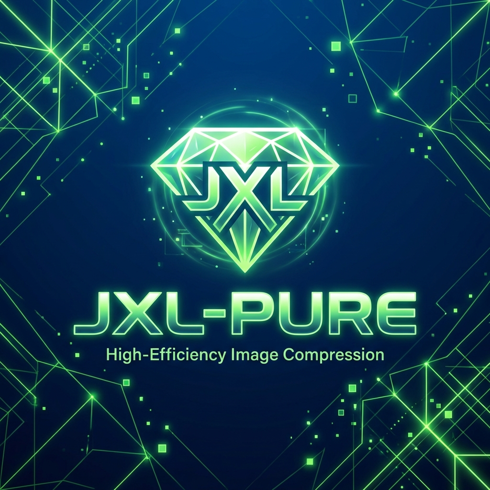

<div align="center">
  


# 💎 JXL-Pure

**The ultimate, ultra-fast, and mathematically lossless JPEG XL batch converter for Linux.**

[](https://opensource.org/licenses/MIT)
[](https://www.gnu.org/software/bash/)
[](https://fishshell.com/)
[](https://github.com/charmbracelet/vhs)

---


*Can't see the GIF? It's being generated by GitHub Actions right now!*

</div>

---

JXL-Pure is designed for power users who want to reclaim massive amounts of disk space (20-50%) without losing a single bit of image quality. Optimized for modern CPUs (like Ryzen) and large image collections on local or portable HDDs.

---

## ⚡ Quick Installation (One-Liner)

Install JXL-Pure to your system with a single command:

```bash
curl -sSL https://raw.githubusercontent.com/void0x14/JXL-Pure/main/install.sh | bash
```

---

## ✨ Key Features

-   **🎯 100% Mathematically Lossless:** Uses `-d 0` and `--lossless_jpeg=1` to ensure bit-for-bit accuracy.
-   **🚀 Lightning Fast Discovery:** Powered by `fd-find` for near-instant file scanning even on 1TB+ drives.
-   **💾 Massive Space Savings:** Save up to 50% storage space while keeping your memories in state-of-the-art JPEG XL format.
-   **🔄 Resumable Logic:** Interrupted? No problem. The script automatically skips already converted files.
-   **⚙️ Flexible Effort Levels:** Choose between "I need it now" (Effort 1) and "I want the smallest file" (Effort 9).
-   **🛡️ Safety First:** Optional `--delete-originals` only triggers after a verified successful conversion.
-   **🐧 Universal Linux Support:** Native scripts for both **Bash** and **Fish Shell**.

---

## 🛠️ Installation (Manual)

### 1. Requirements
Ensure you have the following tools installed (Available on Arch/CachyOS AUR):
```bash
sudo pacman -S libjxl fd
```

### 2. Clone the Repository
```bash
git clone https://github.com/void0x14/JXL-Pure.git
cd JXL-Pure
chmod +x jxl-pure.sh convert.fish
```

---

## 🚀 Usage

### Simple Conversion (Keeps Originals)
```bash
./jxl-pure.sh /path/to/my/photos
```

### Power User (Convert & Delete Originals)
```bash
./jxl-pure.sh /run/media/hdd/photos --delete-originals --effort 3
```

### CLI Arguments
| Argument | Description | Default |
| :--- | :--- | :--- |
| `[path]` | Target directory to process | `.` (Current) |
| `--delete-originals` | Delete JPEGs/PNGs after successful JXL creation | `false` |
| `--effort [1-9]` | Compression level (1=Fastest, 9=Max Compression) | `7` |
| `-h`, `--help` | Show help information | - |

---

## 📊 Speed vs. Compression (Ryzen 3600 Tested)

| Effort | Speed | Compression | Use Case |
| :--- | :--- | :--- | :--- |
| **1 (Lightning)** | ⚡⚡⚡ | High | Large archives (1TB+) where time is money. |
| **3-4 (WebP-like)** | ⚡⚡ | Very High | **Sweet spot.** Best balance for most users. |
| **7 (Squirrel)** | 🐢 | Maximum | Small collections where every byte counts. |

---

## 🤝 Contributing
Forks and Pull Requests are welcome! If you find a bug or have a feature request, please open an issue.

## 📄 License
This project is licensed under the MIT License - see the [LICENSE](LICENSE) file for details.

---
<div align="center">
  <i>Developed with ❤️ for the Linux community.</i>
</div>
